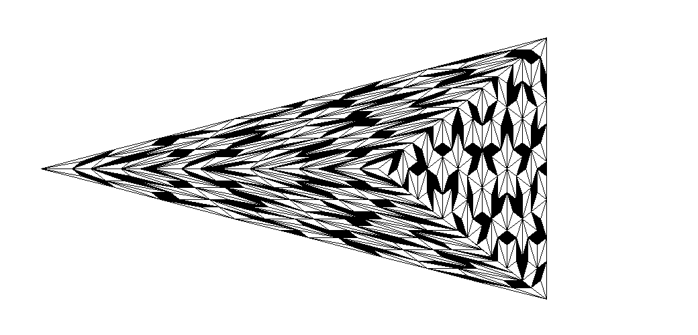
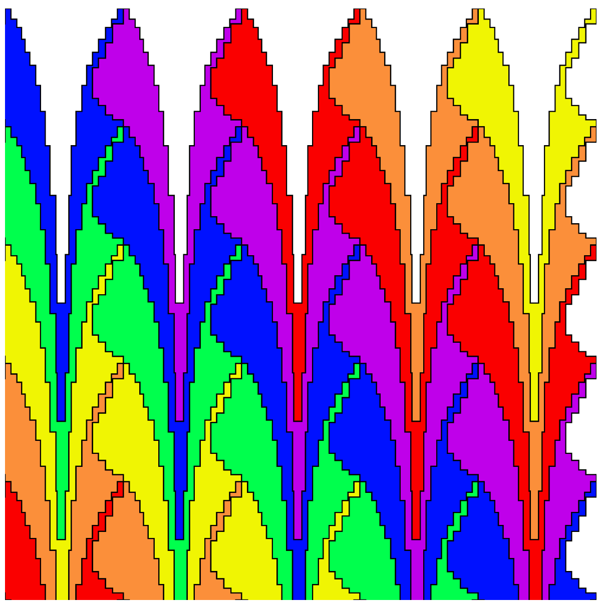
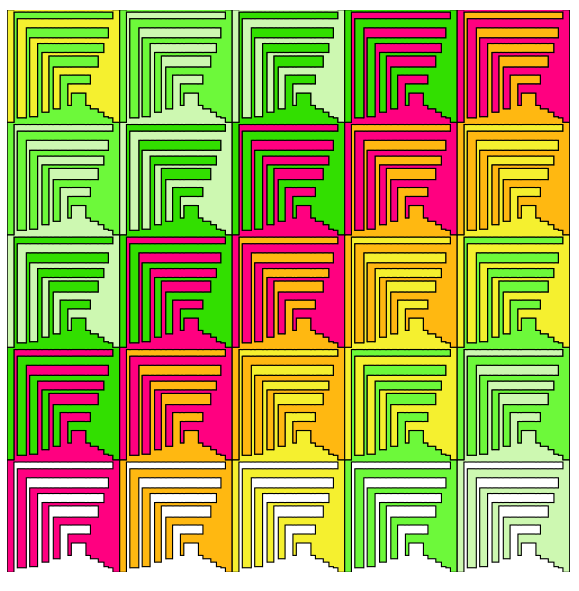
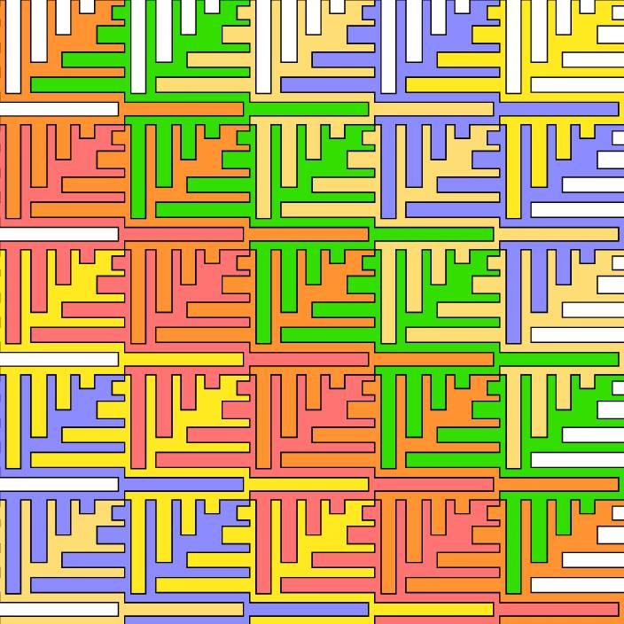
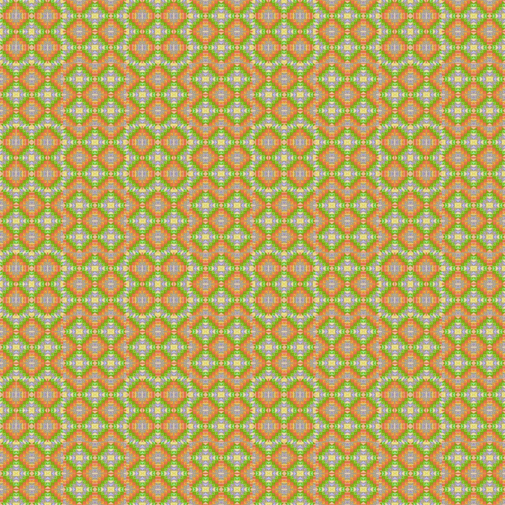
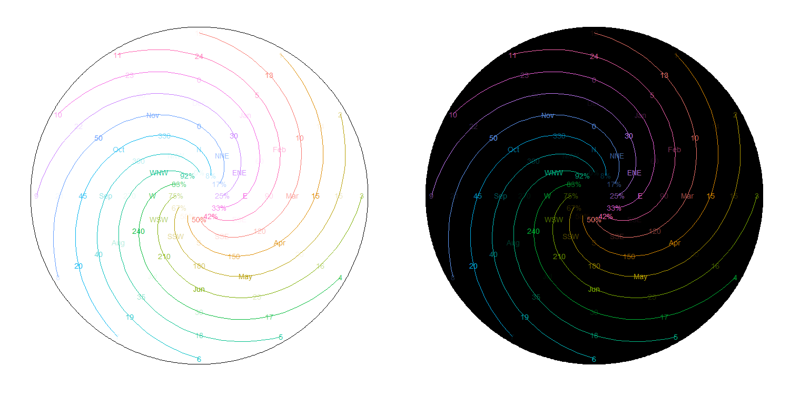

<H1>Projects</H1>

###Some stuff I've spent a little or a lot of time on     

<ul class="nav nav-tabs">
  <li class="active"><a href="#PenroseTilings" data-toggle="tab">Penrose Tilings</a></li>
  <li><a href="#SymmetryandScale" data-toggle="tab">Symmetry and Scale</a></li>
  <li><a href="#TMIClockface" data-toggle="tab">TMI Clockface</a></li>
  <li><a href="#SoccerStatistics" data-toggle="tab">Soccer Statistics</a></li>
  <li><a href="#Website" data-toggle="tab">Website</a></li>
</ul>
 

{#id .class width=480 height=270px}    

  
I translated code from [here](http://preshing.com/20110831/penrose-tiling-explained) into R, then tried to make shapes and patterns that continue to intrigue after repeated viewings
  

 {#id .class width=560 height=270px}  

  

  

I was bored at training early on in my working days, and the instructor was wearing a houndstooth sweater. Naturally, I started thinking about how to make identical shapes that tile the plane, indirectly inspired by Escher (and directly inspired by a sweater). I asked a friend of mine to create a [program](http://dev.zachsilversmith.com/escher) where manipulating one side of a shape would also move the opposite side. This could be extended a lot further (curves, points, etc.) but even this simplified version could make some cool images  

{#id .class width=260 height=260px}\  {#id .class width=260 height=260px}\  {#id .class width=260 height=260px}
                
I took one output from the program (the first image shown below), and played around with it in PowerPoint to see if combining and recombining the image at different scales would turn up anything good     

{#id .class width=260 height=260px}\  {#id .class width=260 height=260px}\  {#id .class width=260 height=260px}

  

  

This is a pretty stupid idea. A clockface packed with too much information, including Hours, Military Hours, Minutes/Seconds (in retrospect, maybe I should've done both), Month, Degrees, Direction, and Percentage. To make everything more confusing, I used many colors, made some elements very transparent, and added swirls to mislead your eyes. Explaining this stupid idea made me like it more

As an undergraduate, I took an independent study course on soccer statistics with [Christopher Anderson](https://twitter.com/soccerquant). Some of this work made it into a few blog posts. Those blog posts are included below, with a shoutout to the [Wayback Machine](https://archive.org/web) for proving magic is real     
1) [Using Castrol Player Ratings To Predict Team Success in MLS](https://web.archive.org/web/20120325162151/http://www.soccerbythenumbers.com:80/2012/02/measurement-matters-validating-mls.html)  
2) [How Efficient Are Player Salaries in Major League Soccer?](https://web.archive.org/web/20120318011645/http://www.soccerbythenumbers.com:80/2012/02/how-efficient-are-player-salaries-in.html)  
3) [Goal Production In Six Leagues](https://web.archive.org/web/20110615103349/http://www.soccerbythenumbers.com:80/2011/06/goal-production-in-six-leagues-or-are.html)    
4) [Comparing the Competitiveness of European Football Leagues](https://web.archive.org/web/20110619040418/http://www.soccerbythenumbers.com:80/2011/06/comparing-competitiveness-of-european.html)  
5) [Is There A Connection Between Matches Played and Goals Per Game?](https://web.archive.org/web/20110722121951/http://www.soccerbythenumbers.com:80/2011/07/too-much-football-is-there-connection.html)  
6) [The Connection Between League Balance, Goals, and Talent](https://web.archive.org/web/20110917233701/http://www.soccerbythenumbers.com:80/2011/08/connection-between-league-balance-goals.html)

<iframe src="index.html" style= "width: 100%; height: 80vh;"> </iframe>

  
