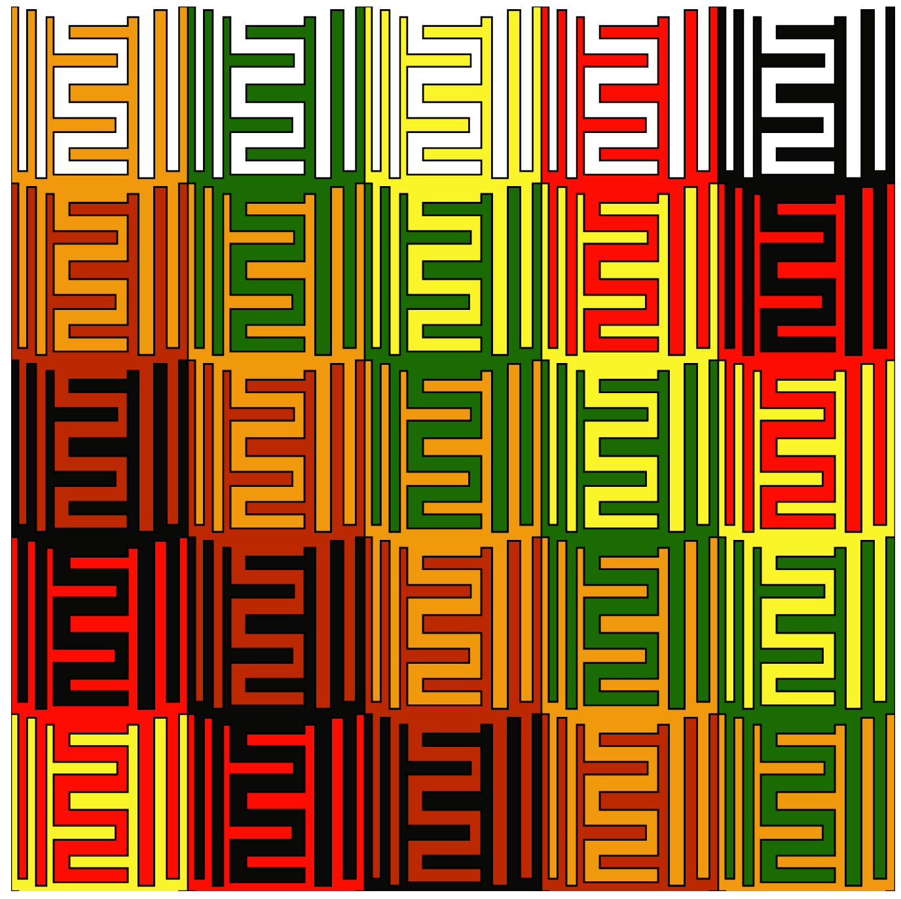

##Some stuff I've spent a little or a lot of time on  <br /> <br />

<ul class="nav nav-tabs">
  <li class="active"><a href="#PenroseTilings" data-toggle="tab">Penrose Tilings</a></li>
  <li><a href="#VisualizingO-RingTheory" data-toggle="tab">Visualizing O-Ring Theory</a></li>
  <li><a href="#SymmetryandScale" data-toggle="tab">Symmetry and Scale</a></li>
  <li><a href="#TMIClockface" data-toggle="tab">TMI Clockface</a></li>
  <li><a href="#SoccerStatistics" data-toggle="tab">Soccer Statistics</a></li>
</ul>
<br>

<div id="myTabContent" class="tab-content">
<div class="tab-pane fade in active" id="PenroseTilings">
{#id .class width=400 height=225px}   {#id .class width=467 height=225px}    
I translated code from [here](http://preshing.com/20110831/penrose-tiling-explained) into R, then tried to make shapes and patterns which continue to intrigue after repeated viewings
</div>  

<div class="tab-pane fade" id="VisualizingO-RingTheory">
When I first read about [O-ring theory](https://en.wikipedia.org/wiki/O-ring_theory_of_economic_development), I was impressed with the idea, but unfortunately, I wasn't able to find any good graphical displays of the output from different groups of workers. The following illustrates when workers of a certain efficiency level would benefit from banding together, when they should maintain the current group size, and when they should break into smaller groups  

```{r, echo = FALSE, message=FALSE, warning=FALSE, fig.align='center'}
library("RColorBrewer")
library("gplots")
                
oring = matrix(NA, nrow=100, ncol=200)
rownames(oring) = seq(from=.99, to=0, by=-.01)
colnames(oring) = seq(from=0, to=199, by=1) 
for (i in 1:100){
for (j in 1:200){
oring[i,j] = as.numeric(colnames(oring)[j])*(as.numeric(rownames(oring)[i])^as.numeric(colnames(oring)[j]))
}
}
                
labcol = as.numeric(colnames(oring))
labcol[labcol[1:199]%%10!=0]=NA
                
labrow = as.numeric(rownames(oring))
labrow[(10*labrow[1:100])%%1!=0]=NA
labrow[1]=.99
                
#Whole map
heatmap.2(oring, Rowv=NA, Colv=NA, col = brewer.pal(11,"RdYlGn"), tracecol=NA, labCol = labcol, labRow = labrow, density.info=c("none"), xlab = "Number of Workers", ylab = "Worker Efficiency", main="Heatmap of Output in O-ring Theory")

```
As you can see,the most efficient workers are responsible for the largest deviations in output, so let's zoom in on those workers  
                
```{r, echo = FALSE, message=FALSE, warning=FALSE, fig.align='center'}
#action at the top
heatmap.2(oring[1:11,], Rowv=NA, Colv=NA, col = brewer.pal(11,"RdYlGn"),tracecol=NA, labCol = labcol, density.info=c("none"),  xlab = "Number of Workers", ylab = "Worker Efficiency", main = "Output of Most Efficient Workers" )
                
#which.max(oring[100,])
# at 99 people or 100 people, (the actual value according to wolfram alpha is about 99.4992) - the output gets to 36.6
                
                
```
These workers seem to benefit from forming small groups, but they face diminishing - and even negative - returns to joining together after achieving a certain group size. 

Even those workers with 99% efficiency top out at groups of about 100 workers, as shown below  
                
```{r, echo = FALSE, message=FALSE, warning=FALSE, fig.align='center'}
plot(0:199, oring[1,], xlab = "Number of Workers", ylab = "Output", title(main = "Output of Workers with 99% efficiency"))
```
For the sake of giving the reader greater color, here's a heatmap focusing on those workers with efficiencies below 90%  
                
```{r, echo = FALSE, message=FALSE, warning=FALSE, fig.align='center'}
#action at the low end
heatmap.2(oring[11:100, 1:50], Rowv=NA, Colv=NA, col = brewer.pal(11,"RdYlGn"),tracecol=NA, labCol = labcol, labRow = labrow, density.info=c("none"),  xlab = "Number of Workers", ylab = "Worker Efficiency", main = "Focus on the bottom 90%")
```
                
Where the 99% efficient workers top out at an output of ~37, 89% efficient workers can't even reach 4!  
<br />  
Whether or not this makes the O-ring theory more or less believable, seeing these results should give you a better intuition about the model's claims   
                                
</div>

<div class="tab-pane fade" id="SymmetryandScale">
I was bored at training early on in my working days, and the instructor was wearing a houndstooth sweater. Naturally, I started thinking about how to make identical shapes that tile the plane, indirectly inspired by Escher (and directly inspired by a sweater). I asked a friend of mine to create a [program](http://dev.zachsilversmith.com/escher) where manipulating one side of a shape would also move the opposite side. This could be extended a lot further (curves, points, etc.) but even this simplified version could make some cool stuff   

{#id .class width=290 height=290px}\  {#id .class width=290 height=290px}\  {#id .class width=290 height=290px}
                
I took one output from the program (the first image shown below), and played around with it in PowerPoint to see if combining and recombining the image at different scales would turn up anything good


{#id .class width=290 height=290px}\  {#id .class width=290 height=290px}\  {#id .class width=290 height=290px}
</div>
  
<div class="tab-pane fade" id="TMIClockface">
  
This is a pretty stupid idea. A clockface packed with too much information, including Hours, Military Hours, Minutes/Seconds (in retrospect, maybe I should've done both), Month, Degrees, Direction, and Percentage. To make everything more confusing, I used many colors, made some elements very transparent, and added swirls to mislead your eyes. Explaining this stupid idea made me like it more
</div>
  
<div class="tab-pane fade" id="SoccerStatistics">
As an undergraduate, I took an independent study course with [Christopher Anderson](https://twitter.com/soccerquant) looking into soccer statistics. Some of this work made it into a few blog posts. Those blog posts are included below, with a shoutout to the wayback machine for proving magic is real  
 [Using Castrol Player Ratings To Predict Team Success in MLS](https://web.archive.org/web/20120325162151/http://www.soccerbythenumbers.com:80/2012/02/measurement-matters-validating-mls.html)  
 [How Efficient Are Player Salaries in Major League Soccer?](https://web.archive.org/web/20120318011645/http://www.soccerbythenumbers.com:80/2012/02/how-efficient-are-player-salaries-in.html)  
 [Goal Production In Six Leagues](https://web.archive.org/web/20110615103349/http://www.soccerbythenumbers.com:80/2011/06/goal-production-in-six-leagues-or-are.html)    
 [Comparing the Competitiveness of European Football Leagues](https://web.archive.org/web/20110619040418/http://www.soccerbythenumbers.com:80/2011/06/comparing-competitiveness-of-european.html)  
 [Is There A Connection Between Matches Played and Goals Per Game?](https://web.archive.org/web/20110722121951/http://www.soccerbythenumbers.com:80/2011/07/too-much-football-is-there-connection.html)  
 [The Connection Between League Balance, Goals, and Talent](https://web.archive.org/web/20110917233701/http://www.soccerbythenumbers.com:80/2011/08/connection-between-league-balance-goals.html)
</div>
</div>


  
  
